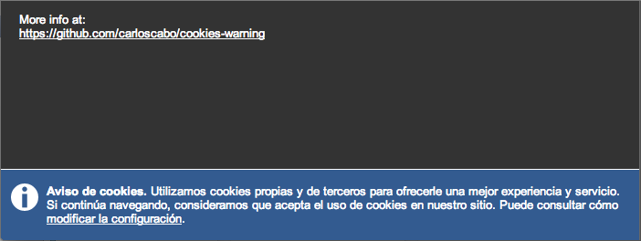

Cookies-warning
===============

Aviso de Cookies genérico.

## Requerimientos

`JQuery`  
`cookies-warning.js`  
`cookies-warning-locales.js`  
`cookies-warning.css`

## Abstract

Aviso de aceptación de Política de Cookies con soporte para internacionalización, personalización de colore básicos, responsive y con un icono SVG.

Se ha usado un append de JQuery ya que así se evita que los buscadores indexen el mensaje de cookies como contenido de la páginas, esto es especialmente importante si el mensaje de cookies se coloca en la parte superior de la página antes de los contenidos.

## Internacionalización

Hay un fichero a parte con el string que se imprime para cada idioma dependiendo del código que se le pase. Si no se le pasa ninguno buscará por defecto el string correspondiente a 'es'.

Los language codes tienen un límite de 10 caracteres.  
**es**  
**es-ES**  
...  
**51-AAA-bkk** _(este es el formato más largo en los ISO)_  

Las internacionalizaciones se encuentran en el fichero:  
`cookies-warning-locales.js`

Así que si se le pasa en la inicialización un string de una longitud superior a 10 chars asume que le estamos pasando el contenido del mensaje de warning. Este contenido de mensaje de warning se rodeará automáticamente de `
 ... 
`.

Más sinfo sobre language codes:  
<http://msdn.microsoft.com/en-us/library/ee825488(v=cs.20).aspx>  
<http://en.wikipedia.org/wiki/Language_code>

## SVG

Para hacer el iconito de _información_ he usado un SVG inline. Es lo más pequeño que se me ha ocurrido (dos círculos y un cuadrado). La ventaja del SVG es que por CSS también se puede cambiar el fondo y el color de la "i" (ver estilos en `cookies-warning.css`).

La desventaja es que en IE8 no se vé, pero tampoco pasa nada.

## Uso

Pasándole el código de lenguaje:

    

Pasándole el código de lenguaje desde rails:

    

Pasándole directamente un string:

    

## To-do

Por defecto hace un `append` del `div` del warning al `body`.
Puede ser útil hacer que se pueda seleccionar el selector al que se hace.

Quitarle todo el JQuery, creo que se puede hacer independiente de JQuery con muy poco código más.

## Known bugs

El IE8 no soporta `SVG` :-(
